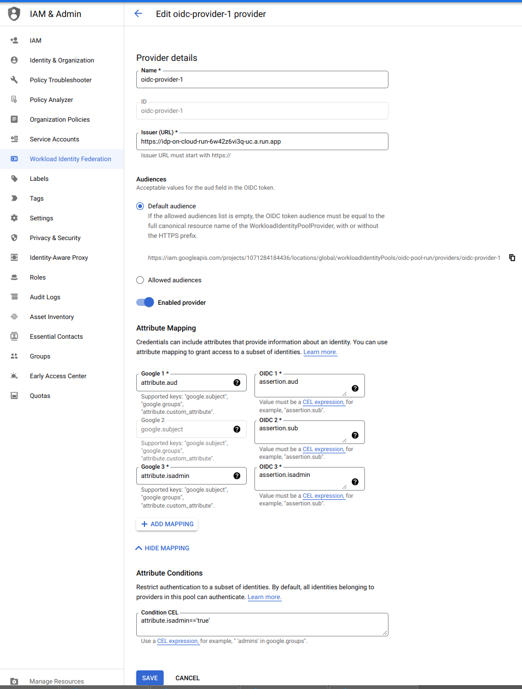

## Authenticating using Workload Identity Federation to Cloud Run, Cloud Functions


This tutorial and code samples cover how customers that use [Workload identity federation](https://cloud.google.com/iam/docs/workload-identity-federation) can authenticate to those GCP Services like Cloud Run and Cloud Functions which accept `OpenID Connect (OIDC)` tokens.

Basically, this walks you through a self-contained setup where you will:

1. Configure a fake `OIDC` identity "provider" on Cloud Run which returns fake `OIDC` tokens (eg. ambient credentials)
2. Configure `GCP Workload Identity` with that `OIDC` provider
3. Deploy a `Cloud Run` application which requires Authentication.
4. Use `Workload Federation` and `IAM API` to exchange the ambient OIDC token from step 1 for a **Google-issued** OIDC token
5. Use google `id_token` from step 4 to access the secure Cloud Run application.

---

A brief background:

- [Workload Identity Federation](https://blog.salrashid.dev/articles/2021/understanding_workload_identity_federation/#using-federated-tokens-to-sign-signjwt-or-get-gcp-idtokens)

    This allows user with ambient credentials from `Azure`, `AWS`, `SAML` or arbitrary `OIDC` providers to authenticate _to_  **GCP Services** like `Compute Engine`, `Google Storage`, etc without needing a local [Google Credential](https://cloud.google.com/docs/authentication/getting-started) or [Service Account](https://cloud.google.com/docs/authentication/production).


- [Authenticating using Google OpenID Connect Tokens](https://blog.salrashid.dev/articles/2019/google_id_token/)

    Describes how you can authenticate _to_ **Applications** that _you_ deploy on platform such as `Cloud Run` or `Cloud Functions`


This article combines both where you can use your ambient workload credentials to authenticate to Cloud Run.


- Why is this different than plain plain Workload Federation?
  
  Well, the token returned by GCP for workload federation is an oauth2 `access_token` intended to be used with GCP services

  The token we actually need to access cloud run is an `id_token`

- So how do we exchange an `access_token` for an `id_token`?  

  Its a bit complicated by we need to use the `access_token` and invoke [ projects.serviceAccounts.generateAccessToken](https://cloud.google.com/iam/docs/reference/credentials/rest/v1/projects.serviceAccounts/generateAccessToken) endpoint.

  That IAM endpoint will generate a google-issued `id_token` with the user-specified audience that matches the Cloud Run service.

---

#### Other usecases

This tutorial runs through setting a fake OIDC server just used for testing...the OIDC token issued by this server is simply used for use with workload federation;  it cannot be used for authentication to Cloud Run.  To authenticate to Cloud Run we need a **google-issued** `id_token`

- `gRPC`: If what your ultimately interested in is an `id_token` for gRPC, follow the step to get an id_token and then supply that to [](https://github.com/salrashid123/grpc_google_id_tokens)

- `SignedURL` If what you really want to use do is issue [GCS Signed URLs](https://cloud.google.com/storage/docs/access-control/signed-urls) using workload identity, you need to invoke [ projects.serviceAccounts.signBlob](https://cloud.google.com/iam/docs/reference/credentials/rest/v1/projects.serviceAccounts/signBlob) using the correct payload

 - `Domain-wide Delegation`:  If what want to do is issue a domain-wide delegated credentials (which IMO should be __really__ rare), use [projects.serviceAccounts.signJwt](https://cloud.google.com/iam/docs/reference/credentials/rest/v1/projects.serviceAccounts/signJwt) with the JWT payload and `sub` field for the new identity.


For more info see [Using Federated Tokens to sign signJWT or get gcp idtokens](https://blog.salrashid.dev/articles/2021/understanding_workload_identity_federation/#using-federated-tokens-to-sign-signjwt-or-get-gcp-idtokens)
 
---


### Setup

As mentioned, there are several preliminary steps involved here which are numbered accordingly.

You will need a GCP project and access to deploy to cloud run (ofcourse)


```bash
export PROJECT_ID=`gcloud config get-value core/project`
export PROJECT_NUMBER=`gcloud projects describe $PROJECT_ID --format='value(projectNumber)'`

## Create service account that the google_issued id_token will use
gcloud iam service-accounts create oidc-federated
```


#### 1.  Fake OIDC server

The following will build and deploy the fake OIDC server and allow the service account associated with the federated identity to access the service

```bash
cd idp_server/

gcloud run deploy   --platform=managed  \
 --region=us-central1   --allow-unauthenticated  \
 --source .   idp-on-cloud-run
```

The fake oidc server's 

- `/token` endpoint will sign whatever well-formed JSON file is sent via POST

- `.well-known/openid-configuration` endpoint will print out the standard oidc configuration 

- `/certs` will return the `JWK` formatted public key used for `JWT` verification

```bash
gcloud run services describe idp-on-cloud-run --format="value(status.url)"

# export some environment variables
export URL=`gcloud run services describe idp-on-cloud-run --format="value(status.url)"`
export IAT=`date -u +%s`
export EXP=`date -u +%s -d "+3600 seconds"`
export EMAIL="alice@domain.com"
export SUB="alice@domain.com"
export ISS=$URL
export NAME="alice"
export WF_AUD="https://iam.googleapis.com/projects/$PROJECT_NUMBER/locations/global/workloadIdentityPools/oidc-pool-run/providers/oidc-provider-1"

## print a sample fake id_token 

curl -s -X POST -d "{  \"name\":\"$NAME\",  \"isadmin\":\"true\", \"mygroups\": [ \"group1\",\"group2\"], \"iss\":\"$ISS\", \"aud\":\"$WF_AUD\",  \"sub\":\"$SUB\", \"iat\":$IAT, \"exp\":$EXP,  \"email\":\"$EMAIL\",  \"email_verified\":true }"  $URL/token  > /tmp/oidccred.txt
```

You can view the contents of the JWT by decoding `/tmp/oidccred.txt` using [jwt.io](jwt.io) debugger

A sample `JWT` may look like

```json
{
  "alg": "RS256",
  "kid": "123456",
  "typ": "JWT"
}
{
  "aud": "https://iam.googleapis.com/projects/1071284184436/locations/global/workloadIdentityPools/oidc-pool-run/providers/oidc-provider-1",
  "email": "alice@domain.com",
  "email_verified": true,
  "exp": 1644598160,
  "iat": 1644594560,
  "isadmin": "true",
  "iss": "https://idp-on-cloud-run-6w42z6vi3q-uc.a.run.app",
  "mygroups": [
    "group1",
    "group2"
  ],
  "name": "alice",
  "sub": "alice@domain.com"
}
```

#### 2. Configure Workload Identity

Now configure workload identity to use the fake oidc server's JWT's

```bash
gcloud iam workload-identity-pools create oidc-pool-run  \
   --location="global" \
   --description="OIDC Pool"  \
   --display-name="OIDC Pool" \
   --project $PROJECT_ID


gcloud iam workload-identity-pools providers create-oidc oidc-provider-1  \
     --workload-identity-pool="oidc-pool-run"     --issuer-uri="$ISS"   \
      --location="global"  \
      --attribute-mapping="google.subject=assertion.sub,attribute.isadmin=assertion.isadmin,attribute.aud=assertion.aud" \
      --attribute-condition="attribute.isadmin=='true'" \
      --project $PROJECT_ID

# write the GOOGLE_APPLICATION_CREDENTIAL file to /tmp/sts.creds
gcloud iam workload-identity-pools create-cred-config \
     projects/$PROJECT_NUMBER/locations/global/workloadIdentityPools/oidc-pool-run/providers/oidc-provider-1  \
     --output-file=/tmp/sts-creds.json  \
     --credential-source-file=/tmp/oidccred.txt


## Associate the federated identity (alice@domain.com) the permission to impersonate the service account
gcloud iam service-accounts add-iam-policy-binding oidc-federated@$PROJECT_ID.iam.gserviceaccount.com \
    --role roles/iam.workloadIdentityUser \
    --member "principal://iam.googleapis.com/projects/$PROJECT_NUMBER/locations/global/workloadIdentityPools/oidc-pool-run/subject/alice@domain.com"
```

Note that the `/tmp/sts-creds.json` file does **NOT** specify a service account since IAMCredentials API support [direct federation](https://blog.salrashid.dev/articles/2021/understanding_workload_identity_federation/#oidc-federated).  Also note that were instructing the credential to find the _ambient_ credential set at `/tmp/oidccred.txt`


```json
{
  "type": "external_account",
  "audience": "//iam.googleapis.com/projects/1071284184436/locations/global/workloadIdentityPools/oidc-pool-run/providers/oidc-provider-1",
  "subject_token_type": "urn:ietf:params:oauth:token-type:jwt",
  "token_url": "https://sts.googleapis.com/v1/token",
  "credential_source": {
    "file": "/tmp/oidccred.txt"
  }
}
```

If you're on the cloud console, your configuration should look like




#### 3. Deploy secure `Cloud Run` application 

Now deploy an application that is secure.  This is the app we want to access using the google `id_token`

```bash
cd server

gcloud run deploy   --platform=managed \
   --region=us-central1  \
   --no-allow-unauthenticated \
   --source .   federated-auth-cloud-run

export TEST_URL=`gcloud run services describe federated-auth-cloud-run --format="value(status.url)"`

# verify that you can't access the service
curl -s $TEST_URL

# allow the service account we will eventually use for access to the cloud run service
gcloud run services add-iam-policy-binding federated-auth-cloud-run \
  --member="serviceAccount:oidc-federated@$PROJECT_ID.iam.gserviceaccount.com" \
  --role="roles/run.invoker"
```


#### 4. Use `Workload Federation` and `IAM API` to create a google id_token

GCP Auth libraries automatically 'understand' the specific external identity provided by federation.

For us, export the variable


```bash
export GOOGLE_APPLICATION_CREDENTIALS=/tmp/sts-creds.json 
```

Then when application default is used to call `generateIdToken()`....well,

see the flow described [here](https://blog.salrashid.dev/articles/2021/understanding_workload_identity_federation/#oidc-federated)


#### 5. Use google `id_token` to access cloud_run

Now that we have a **Google-issued** id_token, use that to access Cloud Run

The full flow in python is like this"

```bash
#!/usr/bin/python
from google.auth import credentials
from google.cloud import  iam_credentials_v1

import google.auth
import google.oauth2.credentials

from google.auth.transport.requests import AuthorizedSession, Request

url = "https://federated-auth-cloud-run-6w42z6vi3q-uc.a.run.app/dump"
aud = "https://federated-auth-cloud-run-6w42z6vi3q-uc.a.run.app"
service_account = 'oidc-federated@mineral-minutia-820.iam.gserviceaccount.com'

client = iam_credentials_v1.services.iam_credentials.IAMCredentialsClient()

name = "projects/-/serviceAccounts/{}".format(service_account)
id_token = client.generate_id_token(name=name,audience=aud, include_email=True)

print(id_token.token)

creds = google.oauth2.credentials.Credentials(id_token.token)
authed_session = AuthorizedSession(creds)
r = authed_session.get(url)
print(r.status_code)
print(r.text)
```


---

### Test Clients

This repo woudn't be a repo without samples, see the `clients/` folder for a language of your choice.

Note that for each, you must edit the source file and specify the url audience and service account you used.

Also remember to set `export GOOGLE_APPLICATION_CREDENTIALS=/tmp/sts-creds.json `

